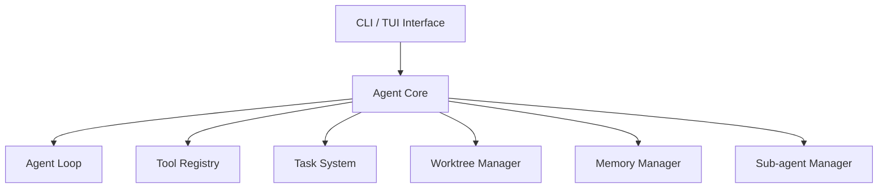

# Nano CC


**Nano CC** 是一个高度模块化的 Agent 运行时平台。本项目旨在成为真实工作区中强大的 AI 助手，它可以深度理解需求、检查代码、规划工作、调用工具、追踪任务、委托子 Agent，并能在异步环境下完成长期任务，极大减少开发者在多步变更、代码理解等高上下文场景中的认知开销。

## 🌟 核心特性

- **🔄 智能 Agent 循环 (Agent Loop)**：支持从“思考 -> 行动 -> 观察”的完整自主控制流，具有强鲁棒性的决策能力。
- **📋 状态与多任务管理 (Task System)**：通过 `TaskGraphStore` 提供基于 DAG（有向无环图）的任务拆解与进度追踪。
- **📦 强悍的工具生态 (Tool Registry)**：内置标准化的工具注册、发现和 Schema 校验机制，无缝集成文件系统、Shell 及任务调度。
- **🧠 记忆与上下文压缩 (Memory Manager)**：动态管理长短期上下文，在面临 Token 预算压力时，智能压缩低优先级历史记忆。
- **👥 子代理编排 (Sub-agent Orchestration)**：支持根据任务特征孵化专业的子代理，实现隔离计算和并发处理。
- **⚡ 异步后台任务 (Async Task Manager)**：可分离耗时操作（如构建、测试、网络请求），提供实时后台通知与状态跟踪。

---

## 💡 设计亮点

本项目在工程实现上高度重视**代码安全**、**数据一致性**和**高效协作**：

### 🛡️ 严格的代码与操作安全
- **工作区隔离 (Worktree Isolation)**：核心的 `Worktree Manager` 将任务标识与底层目录路径彻底解耦。所有的文件工具调用必须经过解析的工作区根目录进行。系统原生**拒绝路径逃逸 (Path Escape) 攻击**，隔离潜在的安全风险。
- **显式权限边界**：基于 `Tool Registry` 的执行引擎具备细粒度的权限感知（Permission-Aware），任何对外部系统的操作皆可审计，杜绝静默篡改。

### 🔗 极致的数据一致性
- **双写原子锁 (Atomic Lock Dual-Writing)**：针对核心的复杂任务依赖，`TaskGraphStore` 在更新任务节点状态及底层检索索引时，通过原子锁实现了强一致性双写（Dual-written），即便在多并发工具调用或后台任务反馈时也能保障内存与存储的绝对一致。

### 🤝 智能的高效协作
- **Teammate IDLE 机制 (MessageBus)**：代理不是冷冰冰的脚本，而是以真实团队成员（Teammate）的身份接入 MessageBus。在空闲（IDLE）状态下，它会自动轮询系统消息箱，**主动认领并执行未分配的就绪任务 (ready_unowned)**，实现真正无缝的人机协同开发。

---

## 🏗 核心架构

系统以 **Agent Core** 为中心进行模块化设计：



---

## 🚀 快速开始

### 环境要求
- **Python** >= 3.11
- **uv** 

### 安装与运行

```bash
# 1. 克隆仓库
git clone https://github.com/your-username/nano-cc.git
cd nano-cc

# 2. 同步并安装依赖 (uv 会自动解析 pyproject.toml 并创建 .venv)
uv sync

# 3. 运行 Agent CLI 或 TUI 界面
uv run python -m cli.app
# 或者使用底层虚拟环境直接运行
# .venv/bin/python -m cli.app

# 4. 执行测试集以验证通过性
uv run pytest
```

### 配置大模型
支持兼容 OpenAI 标准的网关接入，配置以下环境变量即可激活：
```bash
export OPENAI_API_KEY="your_api_key_here"
export OPENAI_BASE_URL="your_custom_gateway_if_any"
export OPENAI_MODEL="your_custom_model"
```

---

## 📄 许可证

本项目采用 [MIT License](./LICENSE) 开源许可证。
